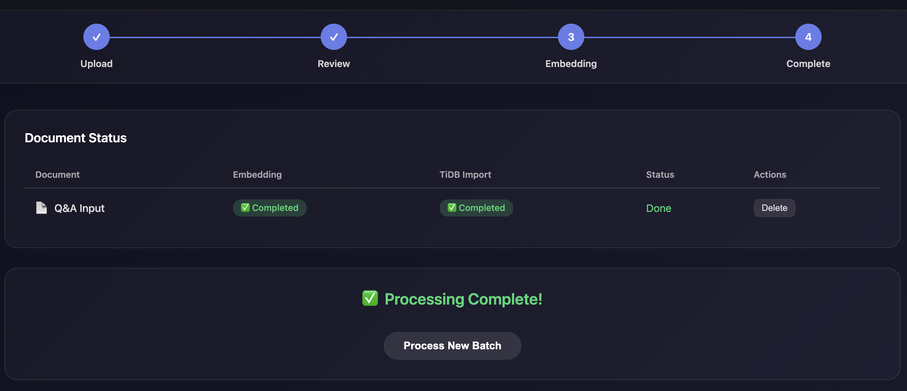

# Agentic Search

With its support for MCP servers, we can support "agentic search" from llama nexus. That is to support transparent knowledge base search via the `/chat/completions` API. There is no need for the llama nexus client to handle any tool call or MCP. It works like this: 

A `search()` tool is registered with llama nexus from an MCP server. When the user asks a question via the `/chat/completions` API, llama nexus knows to use the `search()` tool internally with its downstream LLM, and respond based on the search result. The user automagically gets a correct response to its `/chat/completions` request without needing to know anything about MCP tool calls or the knowledge base!

In this tutorial, you will learn how to set two databases from the same source materials. One is a Qdrant vector database to support semantic search, and the other is a TiDB relational database to support keyword search. We could improve the search accuracy by searching both databases. We will cover

* How to set up the databases
* How to add data and index to the databases
* How to set up the agentic search MCP server that provides the `search()` tool
* How to add the agentic search MCP server to llama nexus
* How to test the fina llama nexus set up

## Prepare databases

We use Qdrant and TiDB to store the knowledge content in vector and full text formats respectively. They enable semantic and keywords searches of the knowledge base.

### Qdrant cloud

Create a Qdrant cloud account here: https://cloud.qdrant.io/

Create a new cluster in any region.

Click open the cluster name, go to the API Keys tab to get an API key.


Open the Dashboard or Cluster UI for this cluster by clicking on the `...` button next to the cluster name. The base URL of the Dashboard is the base URL for connecting to the cluster.

```
https://bb8ab5cf-eae2-4c7c-9493-5f7a183c89b8.us-east4-0.gcp.cloud.qdrant.io:6333
```

#### Optional: create your own collection in Qdrant

> This is optional because the system will automatically create this vector collection if it does not exist. If the collection already exists, the system will write new data into the collection.

In the Console tab to the left of the Dashboard page, type in the following API request to create a new vector collection named `myPoints`.

```
PUT collections/myPoints
{
  "vectors": {
    "size": 1536,
    "distance": "Cosine"
  }
}
```

### TiDB cloud

Create an TiDB cloud account here: https://tidbcloud.com/

Create a new cluster in the Singapore (`ap-southeast-1`) region.

Click open the "Overview" tab, and click on the "Connect" button. Write down the following database connection string.

```
mysql://42eZLKLSueg7p8K.root:<PASSWORD>@gateway01.ap-southeast-1.prod.aws.tidbcloud.com:4000/test
```

The `<PASSWORD>` can be revealed once with the Reset Password link above the connection string display.

#### Optional: create your own database table in TiDB

> This is optional because the system will automatically create this table if it does not exist. If the table already exists, the system will write new data into the table.

Click open the "SQL Editor" tab. Enter a SQL command and hit the "Run" button to create a new database.

```
CREATE DATABASE myDB;
```

Then, create a table in `myDB` based on our schema.

```
USE myDB;

CREATE TABLE myItems (
    id INT NOT NULL AUTO_INCREMENT,
    title TEXT NOT NULL,
    content TEXT NOT NULL,
    FULLTEXT INDEX (content) WITH PARSER MULTILINGUAL
);
```

Click open the "Overview" tab, and click on the "Connect" button. Write down the following database connection string.

```
mysql://42eZLKLSueg7p8K.root:<PASSWORD>@gateway01.ap-southeast-1.prod.aws.tidbcloud.com:4000/myDB
```

## Set up knowledge base

Go to https://kb.cardea.cc/ to login from your GitHUb account. Then, click on Settings to configure your knowledge processing pipeline.


### Qdrant

It stores the vectorized knowledge base for semantic search.

| Name | Value | 
| -------- | -------- | 
| Database URL     | Your Qdrant cloud cluster's dashboard URL: `https://bb8ab5cf-eae2-4c7c-9493-5f7a183c89b8.us-east4-0.gcp.cloud.qdrant.io:6333/`     | 
| API Key | Get it from your Qdrant cloud cluster's API Key tab |
| Collection Name | `myPoints` |


### TiDB

It stores the full text knowledge base for keywords search.

| Name | Value | 
| -------- | -------- | 
| Database URL     | The TiDB database connection string from the TiDB dashboard.    | 
| Table Name | `myItems` |

### Embedding Service

The API service that creates vector embeddings for the knowledge content.

| Name | Value | 
| -------- | -------- | 
| Base URL | `https://0x448f0405310a9258cd5eab5f25f15679808c5db2.gaia.domains/v1` |
| Model Name | `gte-qwen2-7b` |
| API Key | `1234` |
| Vector Size | `1536` |

> The Vector Size is determined by the embedding model we use.

### LLM Service

The API service that generates summaries and QAs for search indexes for the knowledge content.

| Name | Value | 
| -------- | -------- | 
| Base URL | `https://0x9fcf7888963793472bfcb8c14f4b6b47a7462f17.gaia.domains/v1` |
| Model Name | `gemma3-27b` |
| API Key | `1234` |

## Add knowledge

After Save Configuration, you can now enter and upload knowledge content from the web site.

### Add a set of QA pairs

If your knowledge is in the form of QA pairs, you can select the "QA Input" tab.

Copy and paste your QA pairs into the text area. The content must be formatted like this:

```
Q: This is a Q
A: This is an A

Q: This is a second Q
A: This is a second A
```


Click on "Process and Create Embeddings" at the bottom of the page.



You will see that both the Qdrant vector collection and TiDB table are populated.

## Start the MCP server

Install the agentic search MCP server for Linux on x86.

```
curl -LO https://github.com/cardea-mcp/cardea-mcp-servers/releases/download/0.8.0/cardea-mcp-servers-unknown-linux-gnu-x86_64.tar.gz

gunzip cardea-mcp-servers-unknown-linux-gnu-x86_64.tar.gz
tar xvf cardea-mcp-servers-unknown-linux-gnu-x86_64.tar
```

> Download for your platform: https://github.com/cardea-mcp/cardea-mcp-servers/releases/tag/0.8.0/

Set the environment variables. The `TIDB_CONNECTION` is the TiDB connection URL from above, which includes the username and password. The `QDRANT_BASE_URL` is the Qdrant cluster connection URL, and it defaults to `http://localhost:6333`.

```
export RUST_LOG=debug
export LLAMA_LOG=debug
export TIDB_CONNECTION=mysql://42eZLKLSueg7p8K.root:<PASSWORD>@gateway01.ap-southeast-1.prod.aws.tidbcloud.com:4000/test
export QDRANT_BASE_URL=https://bb8ab5cf-eae2-4c7c-9493-5f7a183c89b8.us-east4-0.gcp.cloud.qdrant.io:6333
export QDRANT_API_KEY=xxxxxxxx
```

Start the agentic search MCP server with database connection parameters. Make sure that you adjust the `--search-tool-prompt` to describe the search queries that can be performed for this database.

```
nohup ./cardea-agentic-search-mcp-server \
    --socket-addr 127.0.0.1:9096 \
    --transport stream-http \
    search \
    --qdrant-collection myPoints \
    --qdrant-payload-field "full_text" \
    --tidb-ssl-ca /etc/ssl/certs/ca-certificates.crt \
    --tidb-table-name myItems \
    --chat-service https://0xb2962131564bc854ece7b0f7c8c9a8345847abfb.gaia.domains/v1 \
    --embedding-service https://0x448f0405310a9258cd5eab5f25f15679808c5db2.gaia.domains/v1 \
    --limit 5 \
    --score-threshold 0.5 &
```

The MCP server is started on port `9096`. 

## Create an inference server

### Install llama-nexus

The following command installs the Linux on x86 version of llama-nexus.

```
curl -LO https://github.com/LlamaEdge/llama-nexus/releases/download/0.6.0/llama-nexus-unknown-linux-gnu-x86_64.tar.gz

gunzip llama-nexus-unknown-linux-gnu-x86_64.tar.gz
tar xvf llama-nexus-unknown-linux-gnu-x86_64.tar
```

> Download for your platfrom here: https://github.com/LlamaEdge/llama-nexus/releases/tag/0.6.0/

### Configure llama-nexus

Edit the `config.toml` file to specify a port (`9095`) for the gateway seerver to listen to.

```
[server]
host = "0.0.0.0" # The host to listen on.
port = 9095        # The port to listen on.
```

Enable the previously started TiDB search MCP server on port `9096`.

```
[[mcp.server.tool]]
name      = "cardea-agentic-search"
transport = "stream-http"
url       = "http://127.0.0.1:9096/mcp"
enable    = true
```


### Start llama-nexus

```
nohup ./llama-nexus --config config.toml &
```

### Register downstream API servers

Register an LLM chat API server for the `/chat/completions` endpoint.

```
curl --location 'http://localhost:9095/admin/servers/register' \
--header 'Content-Type: application/json' \
--data '{
    "url": "https://0xb2962131564bc854ece7b0f7c8c9a8345847abfb.gaia.domains/v1",
    "kind": "chat"
}'
```

Register an embedding API server for the `/embeddings` endpoint.

```
curl --location 'http://localhost:9095/admin/servers/register' \
--header 'Content-Type: application/json' \
--data '{
    "url": "https://0x448f0405310a9258cd5eab5f25f15679808c5db2.gaia.domains/v1",
    "kind": "embeddings"
}'
```

> You can add an `api-key` field in the `data` structure for API servers that require API key access.

## Test the inference server

Use the command line to request the `/chat/completions` API endpoint directly.

```
curl -X POST http://localhost:9095/v1/chat/completions \
  -H 'accept: application/json' \
  -H 'Content-Type: application/json' \
  -d '{"messages":[{"role":"system", "content": "If the user asks a question, you MUST use the search() tool call and pass in a list of search keywords to search for relevant information and then form your response based on the search results."},{"role":"user", "content": "What prevents cancer?"}]}'
```

