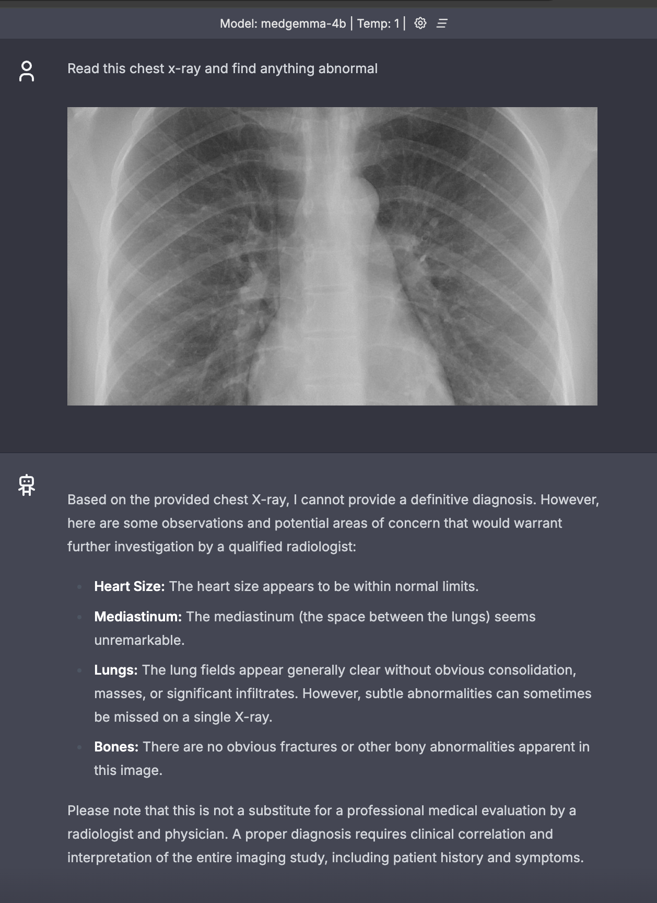

# Quick start with the MedGemma-4b model

[MedGemma-4b](https://huggingface.co/second-state/medgemma-4b-it-GGUF)  is a collection of Gemma 3 variants that are trained for performance on medical text and image comprehension. Developers can use MedGemma to accelerate building healthcare-based AI applications. MedGemma currently comes in two variants: a 4B multimodal version and a 27B text-only version.

### Step 1: Install WasmEdge

First off, you'll need WasmEdge, a high-performance, lightweight, and cross-platform LLM runtime. 

```
curl -sSf https://raw.githubusercontent.com/WasmEdge/WasmEdge/master/utils/install_v2.sh | bash -s
```


### Step 2: Download the LLM model

Next, you'll need to obtain model files: the **MedGemma model** and the **mmproj model**.

```
curl -LO https://huggingface.co/second-state/medgemma-4b-it-GGUF/resolve/main/medgemma-4b-it-Q5_K_M.gguf
curl -LO https://huggingface.co/second-state/medgemma-4b-it-GGUF/resolve/main/medgemma-4b-it-mmproj-f16.gguf
```

### Step 3: Download a portable API server app 

Next, you need an application that can build and OpenAI-compatible API server for the MedGemma models
The [LlamaEdge api server app](https://github.com/LlamaEdge/LlamaEdge/tree/main/llama-api-server) is a lightweight and cross-platform Wasm app that works on any device
you might have. Just download the compiled binary app.

```
curl -LO https://github.com/second-state/LlamaEdge/releases/latest/download/llama-api-server.wasm
```

> The version of the `llama-api-server.wasm` should be v0.18.5 and above.

### Step 4: Chat with the chatbot UI 

The `llama-api-server.wasm` is a web server with an OpenAI-compatible API. You still need HTML files for the chatbot UI. It's optional and you can use `curl` to send an API request.
Download and unzip the HTML UI files as follows.

```
curl -LO https://github.com/LlamaEdge/chatbot-ui/releases/latest/download/chatbot-ui.tar.gz
tar xzf chatbot-ui.tar.gz
rm chatbot-ui.tar.gz
```

Then, start the web server.


```
wasmedge --dir .:. --nn-preload default:GGML:AUTO:medgemma-4b-it-Q5_K_M.gguf \
  llama-api-server.wasm \
  --prompt-template gemma-3 \
  --llava-mmproj medgemma-4b-it-mmproj-f16.gguf \
  --ctx-size 4098 \
  --model-name medgemma-4b

```

> The above command lines work on a Macbook with 16 GB memory.

Upon successful execution, you should see output similar to the following:

```
[2025-05-29 17:07:46.398] [info] llama_api_server in llama-api-server/src/main.rs:544: model_name: medgemma-4b
[2025-05-29 17:07:46.398] [info] llama_api_server in llama-api-server/src/main.rs:553: model_alias: default
[2025-05-29 17:07:46.398] [info] llama_api_server in llama-api-server/src/main.rs:573: ctx_size: 4098
[2025-05-29 17:07:46.398] [info] llama_api_server in llama-api-server/src/main.rs:593: batch_size: 512

...
[2025-05-29 17:07:46.935] [info] llama_api_server in llama-api-server/src/main.rs:907: running_mode: chat
[2025-05-29 17:07:46.935] [info] llama_api_server in llama-api-server/src/main.rs:917: plugin_ggml_version: b5201 (commit 85f36e5e)
[2025-05-29 17:07:46.936] [info] llama_api_server in llama-api-server/src/main.rs:952: Listening on 0.0.0.0:8080
```

Then, go to `http://localhost:8080` on your computer to access the chatbot UI on a web page! You can upload an imange and chat with the model based on the medical image.



### Step 5: Send an API request

You can send an API request to call the model, which is more universal. The following command demonstrates how to send a CURL request to llama-api-server. The request includes a base64-encoded string of an image in the `image_url` field. For demonstration purposes, only a portion of the base64 string is shown here. In practice, you should use the complete base64 string.

> [!TIP]
> [base64.guru](https://base64.guru/converter/encode/image/jpg) provides a tool for encoding JPG to Base64.

```bash
curl --location 'http://localhost:8080/v1/chat/completions' \
--header 'Content-Type: application/json' \
--data '{
    "messages": [
        {
            "role": "system",
            "content": "You are a helpful medical assistant that accurately describes the content of images provided by the user."
        },
        {
            "content": [
                {
                    "type": "text",
                    "text": "Read this chest X-ray and find anything abnormal"
                },
                {
                    "type": "image_url",
                    "image_url": {
                        "url": "/9j/4AAQSkZJRgABAQAAAQABAAD/2wBDAAgFBgcGBQg......X/VaTer/ALzOU/Lg1XMiLMuR3EWMb77/AHsD/DNTIhXPnmvLmwj"
                    }
                }
            ],
            "role": "user"
        }
    ],
    "model": "medgemma-4b"
}'
```


If the request is processed successfully, you will receive a response similar to the following:

```bash
{
    "id": "chatcmpl-e5f777db-c913-45ab-b37f-e2c499c8fa0b",
    "object": "chat.completion",
    "created": 1747652210,
    "model": "medgemma-4b",
    "choices": [
        {
            "index": 0,
            "message": {
                "content": "There is a round, dense opacity in the right lower lobe of the lung. This could be a mass or nodule, and further investigation would be needed to determine its nature.",
                "role": "assistant"
            },
            "finish_reason": "stop",
            "logprobs": null
        }
    ],
    "usage": {
        "prompt_tokens": 27,
        "completion_tokens": 68,
        "total_tokens": 95
    }
}
```

You can also combine the base64 conversion and API call into a single command like this:

```bash
curl --location 'http://localhost:8080/v1/chat/completions' \
--header 'Content-Type: application/json' \
--data '{"messages": [{"role": "system","content": "You are a helpful medical assistant that accurately describes the content of images provided by the user."}, {"content": [{"type": "text","text": ""Read this chest X-ray and find anything abnormal"},{"type": "image_url","image_url": {"url": "'"$(base64 -i /path/to/image.jpg)"'"}}], "role": "user"}], "model": "medgemma-4b"}'
```

Congratulations! You have now started an multimodal app on your own device.
