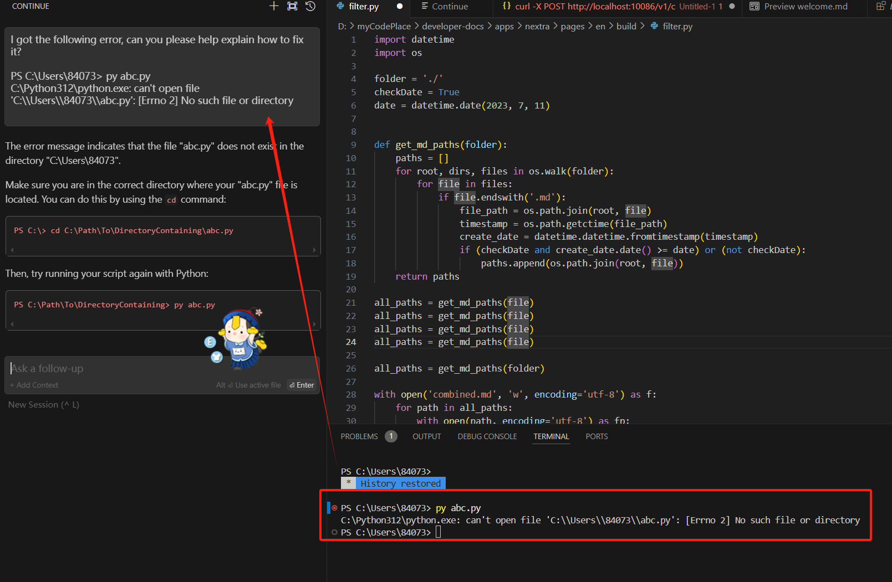

# AI coding assistant: Continue

[Continue](https://github.com/continuedev/continue) is the leading open-source AI code assistant.
It is a copilot-like plugin for VSCode and JetBrains to provide custom autocomplete and chat experiences inside 
those IDEs. You can easily configure it to use a local LlamaEdge LLM as backends. In fact, you can choose different models for

* the autocomplete model for coding tasks
* the chat model for understanding and discussing code
* the embedding model to provide chat context based on local files

## Prerequisites

Follow [this guide](intro) to run an open-source LLM locally.
Since we have a coding application here, you should download a coding LLM like the Codestral.

```
curl -LO https://huggingface.co/second-state/Codestral-22B-v0.1-GGUF/resolve/main/Codestral-22B-v0.1-hf-Q5_K_M.gguf
```

Then start the LlamaEdge API server with the Codestral model and name it `Codestral-22B-v0.1-hf-Q5_K_M`.

```
wasmedge --dir .:. \
    --nn-preload default:GGML:AUTO:Codestral-22B-v0.1-hf-Q5_K_M.gguf \
    --nn-preload embedding:GGML:AUTO:nomic-embed-text-v1.5.f16.gguf \
    llama-api-server.wasm \
    --model-alias default,embedding \
    --model-name Codestral-22B-v0.1-hf-Q5_K_M,nomic-embed-text-v1.5.f16 \
    --prompt-template llama-3-chat,embedding \
    --batch-size 128,8192 \
    --ctx-size 32768,8192
```

## Install Continue

[Load this link](https://marketplace.visualstudio.com/items?itemName=Continue.continue) to install the Continue IDE plugin.  
It will open up your VSCode when you click on the **Install** button on the web page. When you are
asked to configure Continue, just click on **Skip** and finish the installation without selecting a local model.

## Configure Continue

Click on the gear icon on the toolbar to load the `config.json` file for the Continue plugin. The file is located
in your own home directory `$HOME/.continue/config.json`.
You can now change the `config.json` file as follows. 
It asks the Continue plugin to use different models for 
chat, code autocomplete and embeddings.

```
{
  "models": [
    {
      "model": "Codestral-22B-v0.1-hf-Q5_K_M",
      "title": "LlamaEdge",
      "apiBase": "http://localhost:8080/v1/",
      "provider": "openai"
    }
  ],
  "tabAutocompleteModel": {
      "title": "Autocomplete",
      "apiBase": "http://localhost:8080/v1/",
      "model": "Codestral-22B-v0.1-hf-Q5_K_M",
      "provider": "openai"
  },
  "embeddingsProvider": {
    "provider": "openai",
    "model": "nomic-embed-text-v1.5.f16",
    "apiBase": "http://localhost:8080/v1/"
  },
  "customCommands": [
    {
      "name": "test",
      "prompt": "{{{ input }}}\n\nWrite a comprehensive set of unit tests for the selected code. It should setup, run tests that check for correctness including important edge cases, and teardown. Ensure that the tests are complete and sophisticated. Give the tests just as chat output, don't edit any file.",
      "description": "Write unit tests for highlighted code"
    }
  ],
  "allowAnonymousTelemetry": true
}
```

Save the `config.json` file and you are done!

> It is important to note that Continue requires the API endpoint to include a `/` at the end.

## Use the plugin

The following screenshot shows how you can chat with an error message
inside the IDE.




