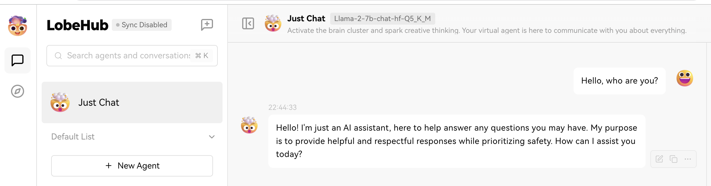

# LobeChat

The [LobeChat](https://github.com/lobehub/lobe-chat) framework is a modern chatbot framework that supports a wide range of 
AI models and custom plugins.
You can use configure it to use LlamaEdge as the backend Large Language Model (LLM) replacing OpenAI. This integration supports:

* The hosted LobeChat service
* Any product built on the open-source LobeChat framework

## Prerequisites

Follow [this guide](intro.md) to run an open-source LLM locally.

## Steps to integrate LobeChat and LlamaEdge

Open the [LobeChat Language Model setting page](https://chat-preview.lobehub.com/settings/modal?agent=&session=inbox&tab=llm&topic=CIfo1UYZ) and choose the first one OpenAI.

First, Enter some random characters in the OpenAI API Key field, and input `http://localhost:8080/v1` in the API Proxy Address field.

Then, enable the Client-Side Fetching Mode. 

Next, Click on the Get Model List button to automatically detect the model you're using. Select that model from the list.

Finally, you can click on the Check button to check the connect status.

After that, go back to [the chat page](https://chat-preview.lobehub.com/chat?session=inbox&agent=) and choose the model you just chose in the previous step. Now you can chat with the model via LobeChat.

