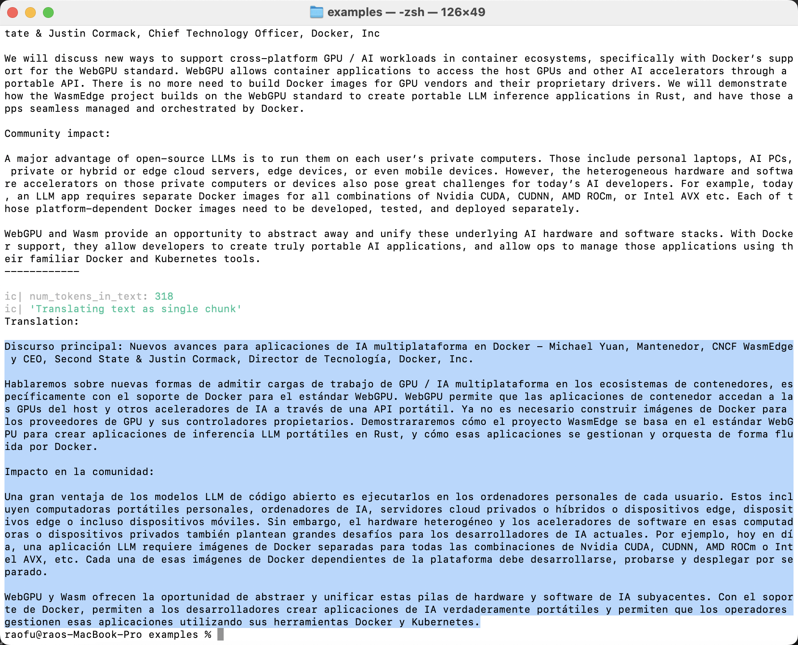

# Translation Agent

This LLM Translation Agent originally built by [Prof. Andrew Ng](https://www.linkedin.com/posts/andrewyng_github-andrewyngtranslation-agent-activity-7206347897938866176-5tDJ/) is designed to facilitate accurate and efficient translation across multiple languages. It employs open source LLMs (Large Language Models) to provide high-quality translations. You can use your own fine-tuned models or any LLMs on Hugging Face like Meta's Llama 3. This documentation shows how the Transgenic Agent utilizes the Gemma-2-9B model for translation.


> For commands on starting and running this agent, refer to [GitHub - Second State/translation-agent](https://github.com/second-state/translation-agent/blob/use_llamaedge/step-by-step-use-LocalAI.md).


## Prerequisites

Follow [this guide](./intro.md) to run an open-source LLM locally.
In this example, we need an open source LLM that is good at multiple languages.
The Gemma-2 7B model from Google is a good choice here.

```
curl -LO https://huggingface.co/second-state/gemma-2-9b-it-GGUF/resolve/main/gemma-2-9b-it-Q5_K_M.gguf
```

Then start the LlamaEdge API server with the Gemma-2-9b model and name it `gemma-2-9b-it-Q5_K_M`.

```
wasmedge --dir .:. \
    --nn-preload default:GGML:AUTO:gemma-2-9b-it-Q5_K_M.gguf \
    --nn-preload embedding:GGML:AUTO:nomic-embed-text-v1.5.f16.gguf \
    llama-api-server.wasm \
    --model-alias default,embedding \
    --model-name gemma-2-9b-it-Q5_K_M,nomic-embed-text-v1.5.f16 \
    --prompt-template gemma-instruct,embedding \
    --batch-size 128,8192 \
    --ctx-size 8192,8192
```

> See detailed instructions to [Run Gemma-2-9B on your own device.](https://www.secondstate.io/articles/gemma-2-9b/)

## Clone the Translation Agent

```
git clone https://github.com/second-state/translation-agent.git
    
cd translation-agent
git checkout use_llamaedge
```

## Configurations

You will also need the following configurations and prerequisites to run the agent app.

```
export OPENAI_BASE_URL="http://localhost:8080/v1"
export PYTHONPATH=${PWD}/src
export OPENAI_API_KEY="LLAMAEDGE"

pip install python-dotenv
pip install openai tiktoken icecream langchain_text_splitters
```

## Run the Translation Agent on top of Gemma-2-9B

Here we test a simple English to Spanish translation task to see the results so as to compare their translation capabilities. You will need to install [WasmEdge](https://github.com/WasmEdge/WasmEdge) and the [LlamaEdge API server](https://github.com/LlamaEdge/LlamaEdge) to run those models across major GPU and CPU platforms.

Find the `examples/example_script.py` file in your cloned translation agent repo and review its code. It tells the agent where to find your document and how to translate it. Change the model name to the one you are using, here we’re using `gemma-2-9b` model; also change the source and target languages you want (here we put `English` as the source language and `Spanish` as the target language).

Find a `examples/sample-texts` folder in your cloned repo. Put [the file you want to translate](https://hackmd.io/TXpN2sI4Tt6_Y33G65V0LQ?view#Source-Text) in this folder and get its path. Here because we named our [source text](https://hackmd.io/TXpN2sI4Tt6_Y33G65V0LQ?view#Source-Text) file `docker.txt`, the relative path to the document would be `sample-texts/docker.txt`.

```
import os

import translation_agent as ta


if __name__ == "__main__":
    source_lang, target_lang, country = "English", "Spanish", "Spain"

    relative_path = "sample-texts/docker.txt"
    script_dir = os.path.dirname(os.path.abspath(__file__))

    full_path = os.path.join(script_dir, relative_path)

    with open(full_path, encoding="utf-8") as file:
        source_text = file.read()

    print(f"Source text:\n\n{source_text}\n------------\n")

    translation = ta.translate(
        source_lang=source_lang,
        target_lang=target_lang,
        source_text=source_text,
        country=country,
        model="gemma-2-9b",
    )

    print(f"Translation:\n\n{translation}")
```

Run the below commands to have your text file translated into English.

```
cd examples    
python example_script.py
```

Wait a few minutes and [the Spanish translation](https://hackmd.io/tdLiVR3TSc-8eVg_E-j9QA?view#English-Translation-by-Gemma-2-9B) will appear on your terminal screen.



