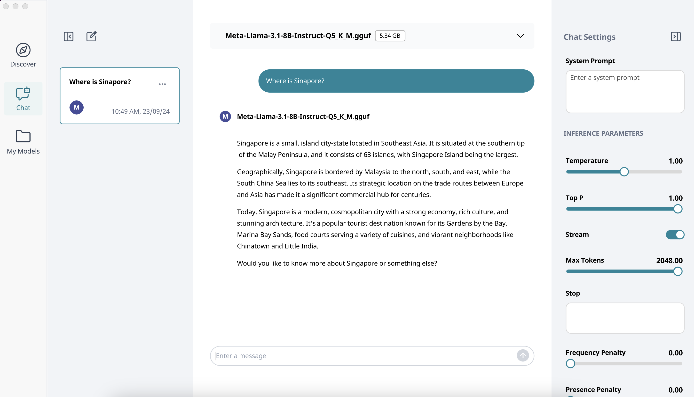

# Quick Start

LlamaEdge is a suite of component libraries and command-line tools for developers to embed and run LLMs in their own apps. 

## Quick Start

### Install the WasmEdge Runtime

You can install WasmEdge and its WASI-NN plugin, which is essential for running LLM models, with the following command line.

```
curl -sSf https://raw.githubusercontent.com/WasmEdge/WasmEdge/master/utils/install_v2.sh | bash -s
```

### Download the LLM model

Next, you'll need to obtain a model file. For this quick start guide, we will use the Llama-3.2-3B model, which is small with high-quality.

```
curl -LO https://huggingface.co/second-state/Llama-3.2-3B-Instruct-GGUF/resolve/main/Llama-3.2-3B-Instruct-Q5_K_M.gguf
```

### Download the portable chatbot app

Next, you need an application that can load the model and provide a UI to interact with the model.

```
curl -LO https://github.com/second-state/LlamaEdge/releases/latest/download/llama-chat.wasm
```

### Chat with the model

With everything set up, it's time to run the chat app with the Llama-3.3-3B model as follows.

```
wasmedge --dir .:. --nn-preload default:GGML:AUTO:Llama-3.2-3B-Instruct-Q5_K_M.gguf llama-chat.wasm -p llama-3-chat
```

Then, you can chat with the model via the command UI.

> To build an OpenAI-compatible API server for the LLM model, check the [LlamaEdge step-by-step](get-started-with-llamaedge.md) guide.

## Quick start with Moxin

Moxin is a cross-platform LLM client written in Rust, and built on LlamaEdge components. It offers an intuitive UI for running LLMs with just a few clicks.

Download the Moxin app install package for your device from the [Moxin website](https://www.moxin.app/). Here's how to get started on macOS:

* Download and install the `dmg` file from https://www.moxin.app/ on your Macbook.
* Browse model cards and choose one model to download after open the Moxin app. As models are quite large, this may take several minutes.
* Engage with the model via a simple and interactive chat interface.



